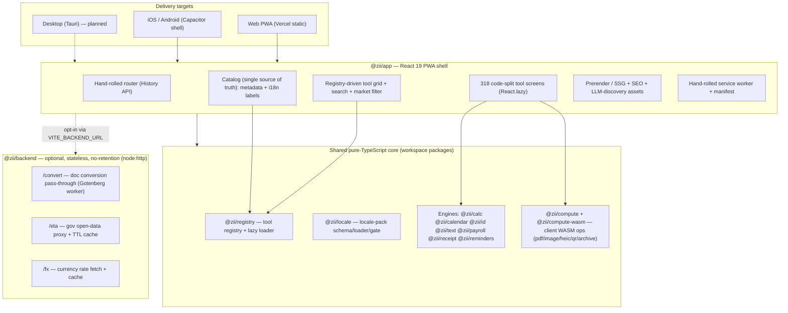
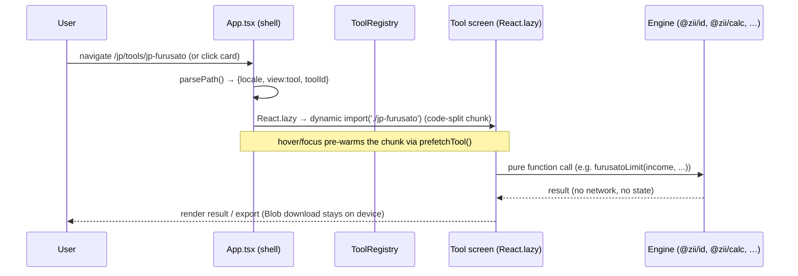

# 02 — Architecture

## Architecture style, in one paragraph

A **layered, plugin-oriented monorepo**. A pnpm + Turborepo workspace holds a set of
**pure-TypeScript engine packages** (market-agnostic computation) below a **single
React 19 PWA shell** that composes them. Each user-facing tool is a **lazily-loaded
plugin** registered in an in-memory **registry**; localization and market-gating are
**data/config layered on top**, never baked into the engines. An optional, **stateless
no-retention backend** exists only for the few operations a privacy-first client
genuinely cannot do itself. The same web build is wrapped into native iOS/Android via
**Capacitor**. The guiding maxim (from `docs/TECH-STACK-PLAN.md`): **"same feature
shapes, local content — fork the config, not the app."**

## The layers

**Dependency direction is strictly downward.** Engines never import the app; the app
imports engines. Engines are consumed as **raw `.ts` source** (Vite/esbuild transpiles
them on the fly — see `packages/app/vite.config.ts`), so there is no separate build
step for the libraries during app development.

## The 14 workspace packages

| Package | Name | Role | Module |
|---------|------|------|--------|
| `app` | `@zii/app` | React 19 PWA shell, all 318 tool screens, prerender, i18n, native shells | M3+ |
| `registry` | `@zii/registry` | Tool registry + lazy plugin loader + market/search filtering | M1 |
| `hello-tool` | `@zii/hello-tool` | Sample tool / smoke test | M1 |
| `locale` | `@zii/locale` | Locale-pack schema (Zod), dated loader, fallback chain, config gate | M2 |
| `compute` | `@zii/compute` | WASM compute registry + lazy op descriptors | M4 |
| `compute-wasm` | `@zii/compute-wasm` | Real WASM bundles: pdf/image/heic/qr/archive/hash | M4 |
| `calc` | `@zii/calc` | Calculators, units, cooking, currency, dates, durations, timestamps, subscriptions | M5 |
| `calendar` | `@zii/calendar` | ROC/和暦 eras, zodiac, lunar/六曜/節気, holidays, business days | M6 |
| `id` | `@zii/id` | ID / checksum validators + test-only generators, per-market | M7 |
| `text` | `@zii/text` | CJK text (OpenCC 繁簡, romaji), data/format tools | M8 |
| `payroll` | `@zii/payroll` | Payroll + tax engine with a pluggable per-jurisdiction rule contract | M9 |
| `receipt` | `@zii/receipt` | TW 統一發票 lottery prize matching | Phase 3 |
| `reminders` | `@zii/reminders` | Holiday-aware recurrence + notification engine | M10 |
| `backend` | `@zii/backend` | Stateless, no-retention conversion/proxy/FX services | M10 |

## Key architectural decisions (and why)

1. **Monorepo of pure engines + one shell** — lets ~319 tools reuse a small set of
   audited engines, keeps each tool tiny, and makes market packs pure data. (Chosen in
   `docs/TECH-STACK-PLAN.md §2.1`.)
2. **Registry + lazy plugin loader** — the catalog can grow without growing the initial
   bundle: every tool is a dynamic `import()` behind a metadata descriptor. See
   [`04-tool-system-and-skills.md`](04-tool-system-and-skills.md).
3. **Single catalog as source of truth** — `packages/app/src/lib/catalog.ts` drives the
   registry metadata, the localized UI labels, *and* the SEO/LLM prerenderer, so the
   three can never drift.
4. **On-device WASM over server compute** — heavy jobs (PDF, image, HEIC, QR, archives,
   hashing) run client-side via `@zii/compute-wasm`; the backend is a last resort.
5. **String-templated SSG, not React SSR** — the prerenderer emits crawlable HTML from
   pure string functions (`packages/app/src/lib/prerender-view.ts`) that mirror the React
   components; the SPA client-renders over it (no `hydrateRoot`). Keeps the SSR bundle
   DOM-free and trivially runnable in plain Node.
6. **No framework where a small hand-rolled version suffices** — no react-router (History
   API), no i18next (a typed dictionary), no `vite-plugin-pwa` (a ~70-line service
   worker), no Express in the backend (`node:http`). This keeps the dependency tree and
   bundle small and license-clean.
7. **Locale-pluggable engines (guardrail §4.4)** — no market logic is hard-coded in an
   engine; brackets, era tables, holiday lists, and toggles (e.g. Taiwan 補班) live in
   dated config/locale packs.

## Data flow: a tool invocation

Every step above is on-device. The only outbound network is (a) lazy-loading the
tool's own JS chunk / a WASM codec / an ML model on first use, and (b) the optional
backend for document conversion or live FX.

## Build & delivery architecture

The app `build` script is a **5-stage SSG pipeline** (`packages/app/package.json`):

1. `vite build` → SPA into `dist/` (hashed, code-split chunks + `.vite/manifest.json`).
2. `node scripts/check-bundle.mjs` → **bundle-budget gate** (fails if initial gz payload
   > 128 KB).
3. `vite build --ssr src/lib/prerender-entry.ts --outDir dist-ssr` → a DOM-free Node
   bundle of the SEO/catalog helpers.
4. `node scripts/prerender.mjs` → writes one static `index.html` per locale × {home,
   tools, category, tool}, plus `sitemap.xml`, `robots.txt`, `ai.txt`, `llms.txt`,
   `llms-full.txt`, per-category LLM indexes, `tools.json`, `opensearch.xml`.
5. `node scripts/stamp-sw.mjs` → stamps the service-worker cache name with a content
   fingerprint so every deploy auto-busts stale caches.

Output is a fully static `packages/app/dist/` deployable to any static host (Vercel
config included). See [`10-build-deploy-mobile.md`](10-build-deploy-mobile.md).

## What is intentionally *not* in the architecture

- No global client state library (Redux/Zustand) — state lives in `App.tsx` `useState`.
- No CSS framework / CSS-in-JS — one stylesheet + CSS custom properties.
- No server-rendered React, no Next.js — static SSG + client SPA.
- No always-on backend — the product runs with zero server. The backend is opt-in.
- No live gov-data feeds, NFC, or LLM inference **yet** — each is deferred behind a
  named prerequisite (data-freshness, capability detection), never faked. See
  [`12-roadmap-and-directions.md`](12-roadmap-and-directions.md).
